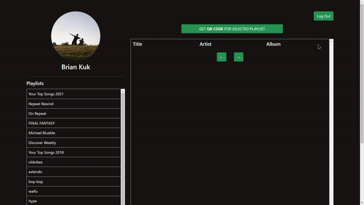
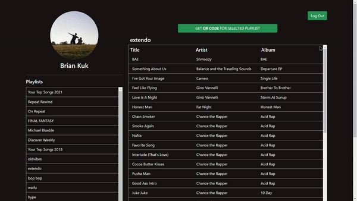

# Spotify QR Code Project

:computer: Features:
- Access user Spotify Account
- View user Spotify playlists
- Play playlist music
- Convert playlist link to QR code
- Download QR Code

:hammer: Created With: 
- React.js
- Bootstrap 5 Framework
- [Spotify API](https://developer.spotify.com/)
- Express.js (Authentication)

## Testing/Installation
:running: To Test Yourself:
- MUST CREATE A SPOTIFY ACCOUNT WITH PLAYLISTS TO USE
- Install the dependencies: 
```
npm install
```
- In one terminal (Front-End):
```
cd client
npm start
```
- In a second terminal (Back-End):
```
cd server
npm run devStart
```

## Preview
Playlist Demonstration:



QR Demonstration:

